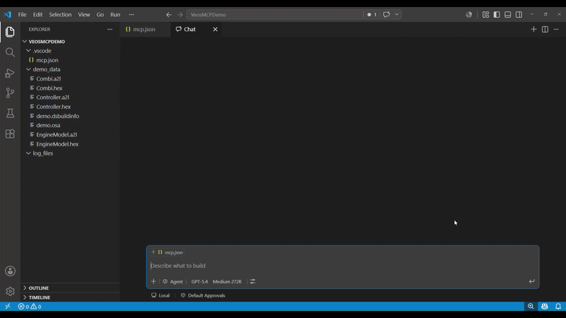

# dSPACE VEOS MCP server

The dSPACE VEOS MCP server lets you control the [dSPACE VEOS](https://www.dspace.com/en/pub/home/products/sw/simulation_software/veos.cfm) simulator using natural language. This is achieved by enabling LLMs to interact with the VEOS simulator and its log files. 

## Prerequisites

The following software must be installed on the same machine as the MCP server:

- [dSPACE VEOS](https://www.dspace.com/en/pub/home/products/sw/simulation_software/veos.cfm)

Optionally, for a developer-focused setup:
- Python 3.12 or later.
- `uv`, the Python package and project manager used to create the environment, install dependencies, and run the server from this source checkout. Install `uv` from the official Astral documentation: https://docs.astral.sh/uv/getting-started/installation/

> The `uv`-based developer-focused setup works on Linux and Windows. The pre-built GitHub release is Windows-only.

## Getting Started

There are two ways to install the VEOS MCP server:

 - Using `uv` for a developer-focused setup that runs the server directly from this source checkout (Windows or Linux). Refer to [Developer-focused setup](#developer-focused-setup). 
 - Directly from the latest GitHub release (Windows only). Refer to [To install the latest GitHub release](#to-install-the-latest-github-release).

 You can easily verify the installation with a quick prompt, for example: "`Give me the state of the VEOS simulator`".


### Developer-focused setup

This setup works on both Windows and Linux, as long as `uv` is installed and dSPACE VEOS is reachable on that machine.

1. Clone this repository.
2. Create the project environment and install dependencies from `pyproject.toml`.

   ```shell
   uv sync   # for minimal setup
   ````
   ```shell
   uv sync --extra dev   # for full developer setup
   ```

3. Follow the MCP server installation instructions for your MCP client (see the documentation for [Claude](https://code.claude.com/docs/en/mcp-quickstart), [Codex](https://developers.openai.com/codex/mcp), [GitHub Copilot](https://docs.github.com/en/copilot/how-tos/provide-context/use-mcp-in-your-ide/extend-copilot-chat-with-mcp), ... ).

    Use `uv run` to start the server directly from this repository checkout (see [VeosMCP.cmd](VeosMCP.cmd) for Windows or [VeosMCP.sh](VeosMCP.sh) for Linux).

    You can also call the `VeosMCP.cmd` (Windows) or `VeosMCP.sh` (Linux) script directly from your MCP client installation, as shown in the following example `.vscode/mcp.json` entry (use `VeosMCP.sh` instead of `VeosMCP.cmd` on Linux):

   ```json
   {
     "servers": {
       "VeosMCP": {
         "type": "stdio",
         "command": "<PATH_TO_REPOSITORY>\\VeosMCP.cmd",
         "args": [
           "--veos-version",
           "<VEOS_VERSION>"
         ]
       }
     }
   }
   ```
    Useful development commands:

      ```shell
      uv run pytest	# run tests
      uv run ruff format src tests	# run formatter
      uv run ruff check src tests		# run linter
      uv build	# build a wheel
      ```

### To install the latest GitHub release

1. Download `veos-mcp-windows.zip` from the latest GitHub release. The archive contains the server executable `veos-mcp.exe`.
2. Follow the MCP server installation instructions for your MCP client (see the documentation for [Claude](https://code.claude.com/docs/en/mcp-quickstart), [Codex](https://developers.openai.com/codex/mcp), [GitHub Copilot](https://docs.github.com/en/copilot/how-tos/provide-context/use-mcp-in-your-ide/extend-copilot-chat-with-mcp), ... ).

   Here is an example installation for GitHub Copilot as a `.vscode/mcp.json` entry that points to the extracted executable:

   ```json
   {
     "servers": {
       "VeosMCP": {
         "type": "stdio",
         "command": "<PATH_TO_EXTRACTED_RELEASE>\\veos-mcp.exe",
         "args": [
           "--veos-version",
           "<VEOS_VERSION>"
         ]
       }
     }
   }
   ```

## Configuration

The VEOS MCP server supports the following arguments. They can be provided in the JSON configuration above as part of the `args` list:

| Argument | Description |
|--------|-------------|
| `--veos-version <VEOS_VERSION>` | Lets you target a specific VEOS installation by version. The following version formats are supported: `26.1`, `26-A`, `26.2`, `26-B`, `2026-A`, and `2026-B`. |
| `--veos-bin-path <PATH>` | Lets you target a specific VEOS installation by providing its `/bin` folder.  |

If these arguments are not provided, the VEOS MCP server uses the newest installed VEOS version.

## Key Features

The VEOS MCP server offers various tools and resources to let agents perform typical VEOS tasks. 
The tools cover a full workflow of configuring the signals of the simulation system, running the VEOS simulation, and validating the simulation result.

The following example prompts show how you can interact with the VEOS MCP server:

- `What signals are unconnected in `my.osa`? Do a best effort matching and create connections accordingly.`
- `Disconnect all the signals from the EngineModel FMU in `my.osa`.`
- `Load `my.osa` and run the simulation for 5 seconds.`
- `Enable bus logging and start the simulation, then check the bus logs for any TCP transmissions.`




*Demo: Let the agent connect signals, run the simulation and validate its result.*

## Tools

> Full list of tools, titles, and parameters. Tool descriptions might be abbreviated here, for full tool descriptions either use the [MCP Inspector](https://modelcontextprotocol.io/docs/tools/inspector) or check the source code directly under [src/veos_mcp/tools](src/veos_mcp/tools).

<details>
<summary><b>Log File Access</b></summary>

- **veos_list_all_available_log_files**
  - Title: List all available VEOS log files
  - Description: Lists all available VEOS log files, including both bus log files (pcapng) and simulation log files.
  - Parameters: None
  - Read-only: **true**

- **veos_get_log_file**
  - Title: Get VEOS log file resource link
  - Description: Gets the resource link to a specified VEOS log file, which can be either a bus log file (pcapng) or a simulation log file. Call `veos_list_all_available_log_files` to get the list of available log files first.
  - Parameters:
    - `log_file_name` (string): Name of the VEOS log file to return as a resource link. Files ending with `.pcapng` are returned as bus log resources; all others are returned as simulation log resources.
  - Read-only: **true**

</details>

<details>
<summary><b>Simulator Control</b></summary>

- **veos_status_info**
  - Title: Get VEOS Simulator Status Info
  - Description: Gets the current status information of the VEOS simulator, including the simulator state. State can be one of: Unloaded, Stopped, Running, Paused, Stopped, Terminated.
  - Parameters: None
  - Read-only: **true**

- **veos_load**
  - Title: Load .osa simulation model into VEOS
  - Description: Loads a simulation model specified by an osa file into the VEOS simulator. If successful, this transitions the simulator to the Stopped state.
  - Parameters:
    - `osa_path` (string): Path to the osa simulation model file to load into VEOS.
  - Read-only: **false**

- **veos_start**
  - Title: Start VEOS simulation
  - Description: Starts the VEOS simulation. This transitions the simulator from Stopped or Paused state to Running state.
  - Parameters: None
  - Read-only: **false**

- **veos_stop**
  - Title: Stop VEOS simulation
  - Description: Stops the VEOS simulation. This transitions the simulator from Running or Paused state to Stopped state.
  - Parameters: None
  - Read-only: **false**

- **veos_apply_config**
  - Title: Configure the VEOS simulator
  - Description: Sets up and configures the VEOS simulation without starting it. Any parameter omitted from the tool call is left unchanged in the VEOS configuration.
  - Parameters:
    - `stop_time` (string, optional): Desired stop time for the simulation in seconds of SimulationTime. If omitted, the existing stop time configuration is left unchanged.
    - `acceleration_factor` (string, optional): Simulation acceleration factor. `Infinity` or `0` means as fast as possible; `1` means real-time speed. If omitted, the existing acceleration factor is left unchanged.
    - `ip_address` (string, optional): IP address of the VEOS simulator. Defaults to localhost `127.0.0.1` if not specified by the VEOS configuration. If omitted, the existing IP address configuration is left unchanged.
    - `bus_log` (boolean, optional): Enables bus logging when true and disables bus logging when false. The change takes effect after `veos_load` is executed.
    - `sim_log` (boolean, optional): Enables simulation logging when true and disables simulation logging when false. The change takes effect after `veos_load` is executed.
  - Read-only: **false**

</details>

<details>
<summary><b>System Extraction</b></summary>

- **veos_get_all_signals_and_ports**
  - Title: Get a list of signals/ports from the VEOS osa simulation system
  - Description: Gets the list of available signals/ports from the given osa file and existing connections between them. Signals and ports are often used interchangeably in the context of the VEOS simulation system.
  - Parameters:
    - `osa_path` (string): Path to the osa simulation model file from which signals, ports, and existing connections are read.
  - Read-only: **true**

</details>

<details>
<summary><b>System Modification</b></summary>

- **veos_add_signal_connections**
  - Title: Connect signals given a JSON file
  - Description: Adds signal connections that are specified in a list within the JSON file to the given VEOS osa file. The signal references are the signal paths.
  - Parameters:
    - `osa_path` (string): Path to the osa simulation model file to modify.
    - `json_path` (string): Path to the JSON file that contains the signal connections to add.
  - Read-only: **false**

- **veos_remove_signal_connections**
  - Title: Disconnect signals given in a JSON file
  - Description: Removes signal connections that are specified in a list within the JSON file from the given VEOS osa file. The signal references are the signal paths.
  - Parameters:
    - `osa_path` (string): Path to the osa simulation model file to modify.
    - `json_path` (string): Path to the JSON file that contains the signal connections to remove.
  - Read-only: **false**

</details>

## Resource Templates

<details>
<summary><b>Log Files</b></summary>

- **veos://logs/sim/{log_file_name}**
  - Title: VEOS Log File
  - Description: Resource for accessing the contents of a VEOS simulation log file. If the specified log file does not exist, an error is returned.
  - Parameters:
    - `log_file_name` (string): Name of the VEOS simulation log file to read.
  - MIME type: `text/plain`

- **veos://logs/bus/{log_file_name}**
  - Title: VEOS Bus Log File
  - Description: Resource for accessing the contents of a VEOS bus log file. If the specified log file does not exist, an error is returned.
  - Parameters:
    - `log_file_name` (string): Name of the VEOS bus log file to read.
  - MIME type: `application/vnd.tcpdump.pcap`

</details>

## Adding MCP Tools

MCP tools are saved in `src/veos_mcp/tools/` and registered with a shared FastMCP instance that is imported from the `veos_mcp.runtime` module.

To add an MCP tool, perform the following steps:

1. Add the tool implementation to an existing module in `src/veos_mcp/tools/` or create a new module there.
2. Register the tool with the shared `FastMCP` instance by using `@mcp.tool(...)`. Provide a clear tool name, title, and description, and use `ToolAnnotations` to describe whether the tool is read-only, destructive, idempotent, or open-world.
3. Use `get_cli().run_sim(...)` or `get_cli().run_model(...)` to define VEOS CLI operations.
4. If you create a new tool module, import it from `src/veos_mcp/tools/__init__.py`:

    ```python
    from veos_mcp.tools import new_module as new_module
    ```

    Also add the new module to `__all__`, otherwise the module is not
    imported when the server starts.

5. Add or update tests under `tests/tools/` to verify the direct Python function behavior.
6. Add the new tool name to `expected_tools` in `tests/test_mcp_surface_smoketest.py`. This ensures that the MCP stdio surface test verifies that the tool is registered.
7. Run `pytest` and `ruff` to validate the implementation, format the code, and check for linting issues.

Here is a minimal tool example:

```python
from veos_mcp.runtime import mcp

@mcp.tool(
    name="veos_new_tool",
    title="New tool",
    description="New tool extending the VEOS MCP server."
)
def veos_new_tool() -> str:
    return "Hello from the new VEOS MCP server tool!"
```